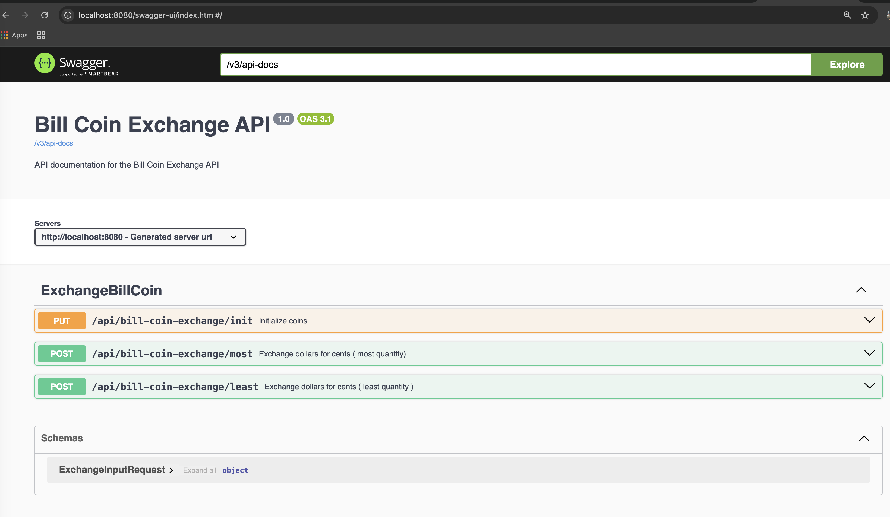

# Bill Coin Exchange
This project is a Spring Boot application for the Bill Coin Exchange API. It provides endpoints to exchange bills for coins and initialize the coin machine.

It contains the Backend and Frontend layers.

Backend Technologies

- Java 21
- Spring Boot 3
- Spring Web
- Spring OpenAPI

Frontend Technologies

- React 19
- Typescript
- Vite

# Backend

### Prerequisites

- Docker
- Docker Compose

### Building and Running the Project with Docker

To build and run the project using Docker, follow these steps:

1. **Clone the repository**:

    ```sh
    git clone https://github.com/kalilmvp/bill-coin-exchange.git
    cd bill-coin-exchange
    ```

2. **Build the Docker image**:

    ```sh
    docker-compose build
    ```

3. **Run the Docker container**:

    ```sh
    docker-compose up
    ```
<br/>
The API's will be available at `http://localhost:8080`.

### API Endpoints
<br/>
#### Exchange Least Quantity Coins

- **URL**: `/api/bill-coin-exchange/least`
- **Method**: `POST`
- **Content-Type**: `application/json`
- **Request Body**:

    ```json
    {
      "value": 1
    }
    ```

- **Response**: Returns the exchanged coins and the machine state.

#### Exchange Most Quantity Coins

- **URL**: `/api/bill-coin-exchange/most`
- **Method**: `POST`
- **Content-Type**: `application/json`
- **Request Body**:

    ```json
    {
      "value": 1
    }
    ```

- **Response**: Returns the exchanged coins and the machine state.

#### Initialize Coins

- **URL**: `/api/bill-coin-exchange/init`
- **Method**: `PUT`
- **Response**: Initializes the coin machine.

### Swagger UI

You can access the Swagger UI to interact with the API endpoints at:

```
http://localhost:8080/swagger-ui/index.html
```



#### Project Structure

- `src/main/java/com/kmvp/billcoinexhange/app/rest`: Contains the REST controllers.
- `src/main/java/com/kmvp/billcoinexhange/app/rest/models`: Contains the request and response models.
- `src/main/resources/apis/requests.http`: Contains example HTTP requests for testing the API.
- `src/test/java/com/kmvp/billcoinexhange/app/`: Contains automated tests.

# Frontend

### Prerequisites

- Node 23
- NPM 11.2.0
- Docker
- Docker Compose
